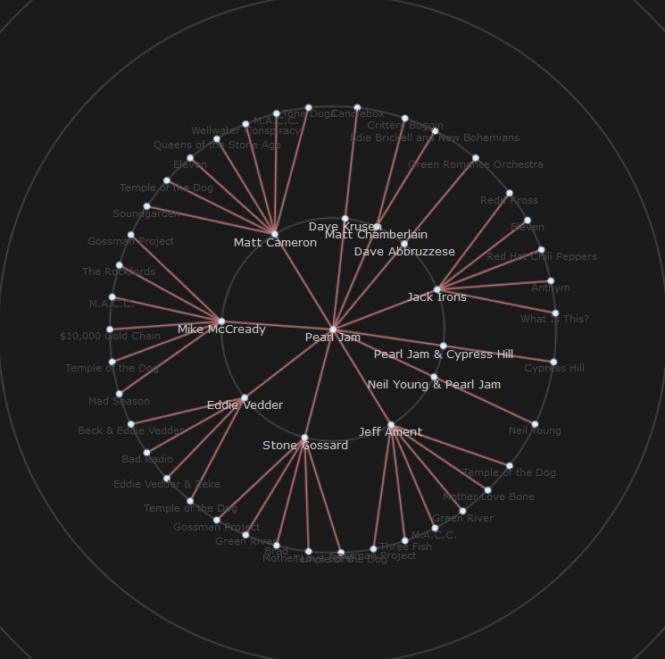
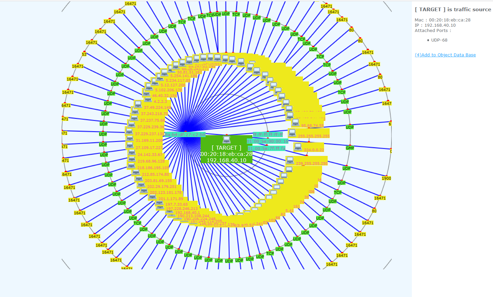
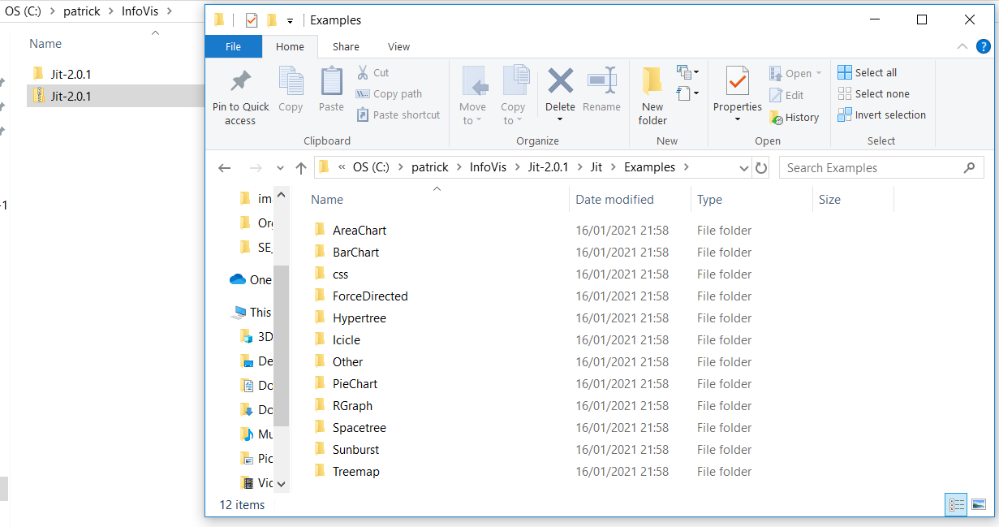
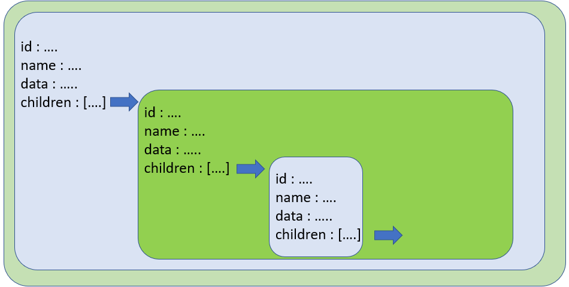

# 2D Visualization with Infovis

Among the cool stuff I came accros the InfoVis Javascript Library is one of my favorites

[JavaScript InfoVis Toolkit](http://philogb.github.io/jit/index.html)

What is Infovis ?  This is a 2D Visualization Javascript library that provides us with a small set of ready to use resources that generates some very cool graphs from a dataset files.

You can see some examples on the InfoVis site.

And have a look specificaly to the [RGRAPH example](http://philogb.github.io/jit/static/v20/Jit/Examples/RGraph/example1.html)

This one is fabulous !!



This is an interactive relation graph.  Try it !

As soon as I saw this, i decided to use it for for drawning some network and security relation graphs.



And actually, it was very easy to do.  Which is another very cool thing that make this library fantastic.

Let me share with you how to do that.

## Install the library and test the RGRAPH example

1- [Download the InfoVis library](http://philogb.github.io/jit/downloads/Jit-2.0.1.zip)

2- Unzip the file



Go to the **Jit\Examples\RGraph** folder and try any html files you want.

The example I prefer is the **example1.html** one.

So let's work on this one

3- delete all files in the RGRAPH folder except the **example1.html** and the **example1.js** files

4.Edit the **example1.html** file and have a look at it. Have a look at the **head** section.

```html
<head>
<meta http-equiv="Content-Type" content="text/html; charset=UTF-8" />
<title>RGraph - Tree Animation</title>

<!-- CSS Files -->
<link type="text/css" href="../css/base.css" rel="stylesheet" />
<link type="text/css" href="../css/RGraph.css" rel="stylesheet" />

<!--[if IE]><script language="javascript" type="text/javascript" src="../../Extras/excanvas.js"></script><![endif]-->

<!-- JIT Library File -->
<script language="javascript" type="text/javascript" src="../../jit.js"></script>

<!-- Example File -->
<script language="javascript" type="text/javascript" src="example1.js"></script>
</head>
```

And we understand that we have here all the aplication files.

The InfoVis engine is the **../../jit.js** file. 

And we understand that the dataset from which the central graph is drawn is in the **example1.js** file.

And from the HTML point of vue, the graph is drawn within the **infovis** div, included into the **center-container** div.

Edit the **example1.js** file and have a look at it.

Go to the **init()** function, and have a look to the variable named **json**... Yes this is the dataset that discribed the graph.  And this is a JSON payload.  

But what we understand now is that this file **example1.js** has 3 parts, on the top until line 29 this is part one, the **init()** function that is part 2 and then all the rest that is part 3.

So if we want to display a new graph from a new dataset, we just have to modify part 2.

Perfect !!! we will comeback to it later.

Let's do some changes to our graph.

### change some graph style details.

Most of the change to do will be one part 3. 

Go to the line number 392 ( //init RGraph )

Change strokeStyle value to **strokeStyle: '#ff0000'**. And re open the **example1.html**.

You change the color of the circles.  Okay,  let's move forward.

Change the color of the nodes and edges.

```javascript
        //Set Node and Edge styles.
        Node: {
            color: '#ddeeff'
        },
        
        Edge: {
          color: '#C17878',
          lineWidth:1.5
        },
```

What is cool with this interactive graph is the fact that when we click on any node, this one moves to the center of the graph, and all other nodes are displayed on several concentric circle that represent a parent - children relationship. And node styles depend of the circle where they are.

These circles represent the depth of the relationshop from the center of the graph. 

The selected object is the root of a 360° tree.

The relation depth is represented by the variable **node._depth**. The value of this variable is an integer which start from 0 ( 0 = graph center, 1 = first circle )

You should now understand how to modify the style of the node labels. And how to display more circles ( more levels ).

### change background color and canvas size

For this we must modify the attached **../css/base.css** file 

Edit this file

You can change the canvas size in the following section. Background-color as well

```css
#center-container {
    width:1100px;
    left:0px;
    background-color:#EEF8FF;
    color:#ccc;
}
```

And you must modify the following section relatively

```css
#container {
    width: 1000px;
    height: 600px;
    margin:0 auto;
    position:relative;
}
```

## The json variable

Let's have a look at the core of the graph, let's have a look at the **json** variable.

This variable is a JSON payload which contains several levels on nested objects that have exactlyt the same atomic structure.

This structure is the following :

```
    {
        id: "0001",
        name: "01:00:5e:00:00:16",
        data :{ 
        relation:""
        },
        children: [
        ]
    }
```
This structure is a node representation.

It has a unique id (string), a name ( string )

This node is the parent of a children node that will be defined as the value of the children key.

And the **children** key is the one that creates the relationship between the current node and it's children node.



The **children** value must be another object with exactly the same keys and values.

- **id** : any string and must be unique
- **name** : a string. this string can be html. ' example : name: "\ hostname",
- **data** : contains a variable named 
- **relation**. That one contains html content that is displayed on the right div named \<div id="right-container"\>. This div is one component of the index.html file. This content is displayed when the central object is selected. You can put here any relevant html content related to the selected object.

## Example

The example folder contains an example of network drawing.

In this example we draw the relationship between a host and other hosts.  

For every displayed host we attach it's mac address the protocol ( tcp / udp ) and the port number.  And then the graph displays in the center of the graph a source host, and in the circles, all the destination hosts to which this is connected. 

Copy all the files contained in the github **example** folder and paste them into your **RGRAPH**  folder, and open the **example.html** file with your browser.

